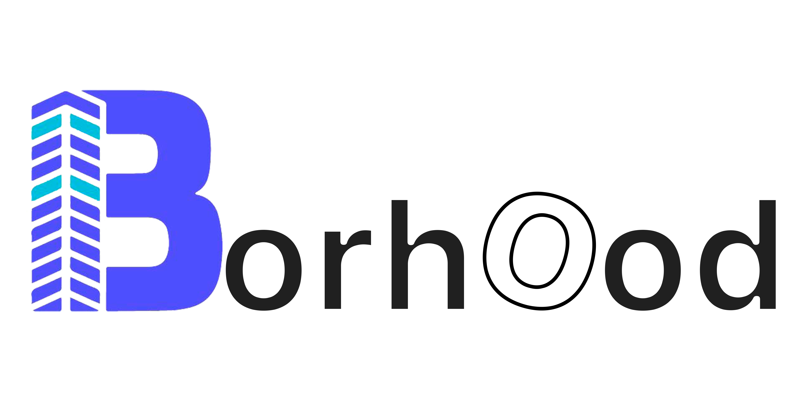

# Borhood Repositorio Oficial 

A residential management application that offers access control by QR codes, efficient communication between residents and security, reservations of common areas and a detailed registration of visits. Borhood simplifies community life by providing a comprehensive solution for residential management.

### Application Features:

- **Smart Voice Login:**

  - Offers an authentication option through voice recognition, ideal for providing assistance to older adults.
  - Google authentication integration to simplify the process for older users.

- **Dynamic Posts through an Integrated Administrative Panel:**

  - Allows the management of dynamic content directly from the application, making it easier to update and interact with users.

- **Advanced Security through Encrypted QR between Visitors and Residents:**

  - Implementation of encrypted QR codes to guarantee security in interactions between visitors and residents.

- **Reservations of Social Areas for Guests via QR:**

  - Facilitates the reservation of social areas through QR codes, providing an efficient and safe experience for guests.

- **Calls with P2P Security System:**

  - Offers secure calls between residents using a peer-to-peer (P2P) system to ensure the privacy and security of communications.

- **Chat with Encryption in Process:**

  - Coming soon, this feature will provide secure chat with encryption, ensuring the confidentiality of conversations.

- **Simple Authentication for Residents:**

  - Provides a simplified authentication process designed specifically for residents, improving the accessibility and usability of the application.

- **Dynamic and Easy-to-Use Administrative Panel:**
  - Offers an intuitive and dynamic administration panel, making application management easier for administrators.

### Application installation

You can download and install the app from the following app stores:

- [App Store (iOS)](https://play.google.com/store/apps/details?id=galo.fly.borhood&hl=es_DO&gl=US)
- [Google Play Store (Android)](https://apps.apple.com/fi/app/borhood/id6468190119)

### Más Trabajos Míos

Aquí hay una lista adicional de mis trabajos y proyectos:

1. **Borhood:** Breve descripción del Proyecto A. Puedes incluir un enlace a más información si está disponible.

2. **Proyecto B:** Breve descripción del Proyecto B. Puedes incluir un enlace a más información si está disponible.

3. **Proyecto C:** Breve descripción del Proyecto C. Puedes incluir un enlace a más información si está disponible.

### Créditos

Este proyecto fue creado y desarrollado por [Nombre del Creador](www.ad.com), quien también ideó el prototipo inicial.

### Contacto

Puedes contactarme a través de los siguientes medios:

- Teléfono: [Whatsapp](www.ad.com)
- Correo electrónico: [Email](www.ad.com)
- Redes sociales:
  - [Linkedin](www.ad.com)
  - [Sitio Web](www.ad.com)

### Ejemplos o Demostraciones

Aquí incluiré imágenes de mis proyectos.
