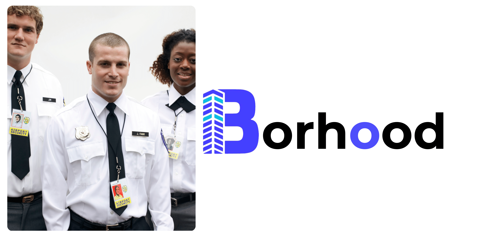
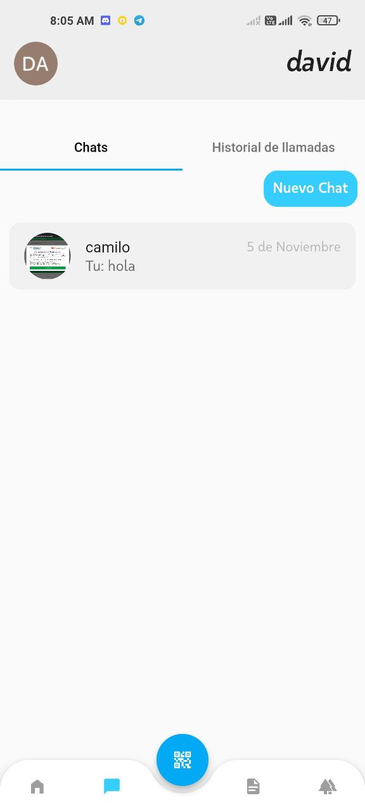
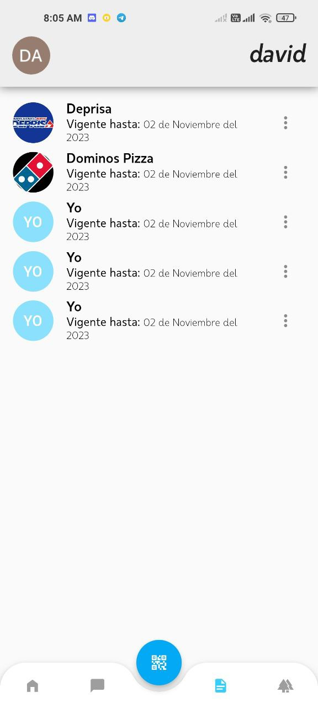
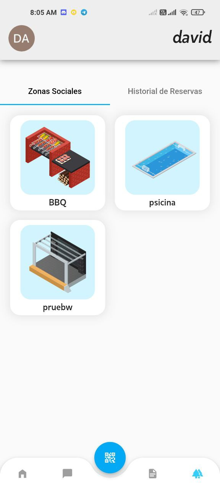
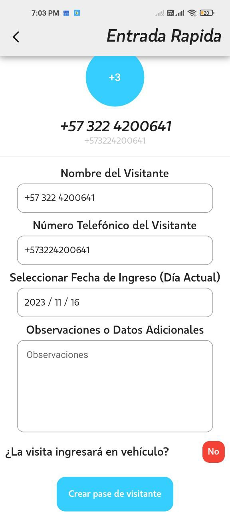
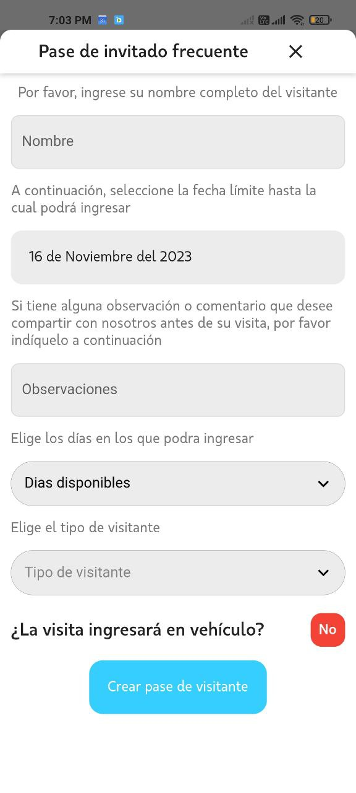
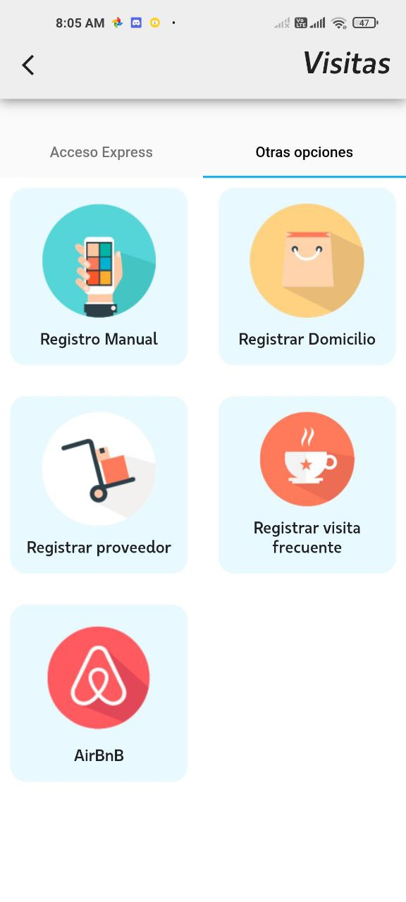
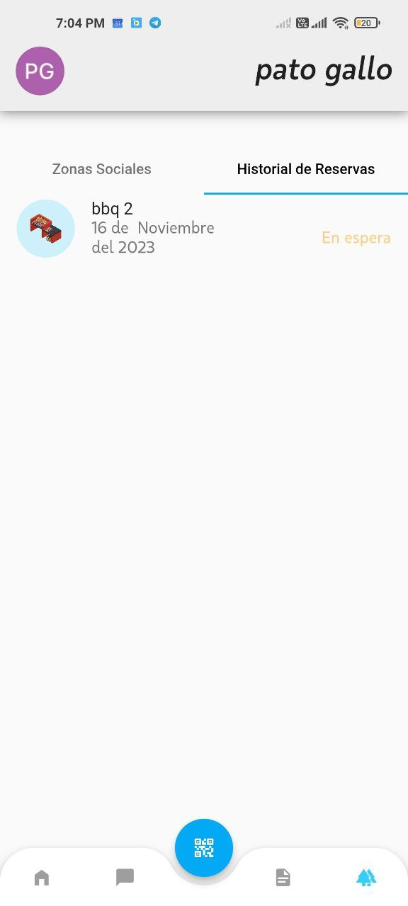
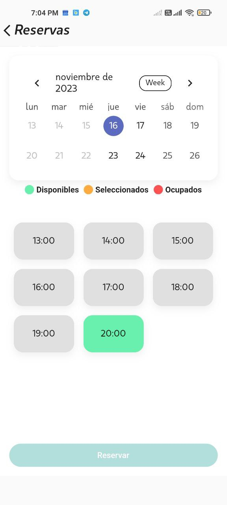
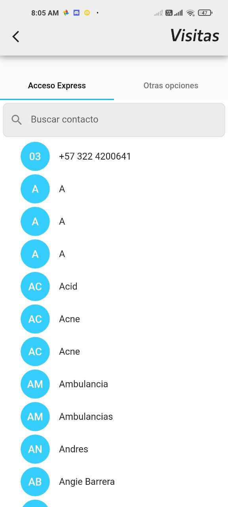

#  Borhood Repositorio Oficial

Borhood is an innovative project in your portfolio that represents a mobile application designed specifically for the taxi sector in Colombia. TaxiApp's main value proposition is to modernize and simplify the current taxi system, significantly facilitating the service request process for users. The application is designed to be adaptable and useful for various taxi companies, suggesting a versatile and customizable platform.

### Application Features:

- **Smart Voice Login:**

  - Offers an authentication option through voice recognition, ideal for providing assistance to older adults.
  - Google authentication integration to simplify the process for older users.

- **Dynamic Posts through an Integrated Administrative Panel:**

  - Allows the management of dynamic content directly from the application, making it easier to update and interact with users.

- **Advanced Security through Encrypted QR between Visitors and Residents:**

  - Implementation of encrypted QR codes to guarantee security in interactions between visitors and residents.

- **Reservations of Social Areas for Guests via QR:**

  - Facilitates the reservation of social areas through QR codes, providing an efficient and safe experience for guests.

- **Calls with P2P Security System:**

  - Offers secure calls between residents using a peer-to-peer (P2P) system to ensure the privacy and security of communications.

- **Chat with Encryption in Process:**

  - Coming soon, this feature will provide secure chat with encryption, ensuring the confidentiality of conversations.

- **Simple Authentication for Residents:**

  - Provides a simplified authentication process designed specifically for residents, improving the accessibility and usability of the application.

- **Dynamic and Easy-to-Use Administrative Panel:**
  - Offers an intuitive and dynamic administration panel, making application management easier for administrators.

---

### Application installation

You can download and install the app from the following app stores:

- [App Store (iOS)](https://apps.apple.com/fi/app/borhood/id6468190119)
- [Google Play Store (Android)](https://play.google.com/store/apps/details?id=galo.fly.borhood&hl=es_DO&gl=US)

---

### More of My Work

Here is an additional list of my works and projects:

1. **[Borhood](https://github.com/santiagogalo/Borhood_Oficial):** It is an innovative project in your portfolio that represents a mobile application designed specifically for the taxi sector in Colombia.

2. **[TaxiApp](https://github.com/santiagogalo/TaxiApp):** It is an innovative project in your portfolio that represents a mobile application designed specifically for the taxi sector in Colombia.

3. **[FinderAlpha](https://github.com/santiagogalo/Finderalpha):** is the definitive tool for traders, designed to optimize decision making in the dynamic stock market.

---

### Credits

This project was created and developed by [Santiago Gallo](https://github.com/santiagogalo), who also came up with the initial prototype.

---

### Contact

You can contact me through the following means:

- Telephone: [Whatsapp](https://api.whatsapp.com/send?phone=573041047207)
- Email: [galo.santiago.g@gmail.com]
- Social networks:
  - [Linkedin](https://www.linkedin.com/in/santiago-gallo-guillen-94a40a264/)

---

### Examples or Demonstrations

    
    
    
    
    
    
    
    
    
    
    
    
    
    
    
    
    
    
    
    

